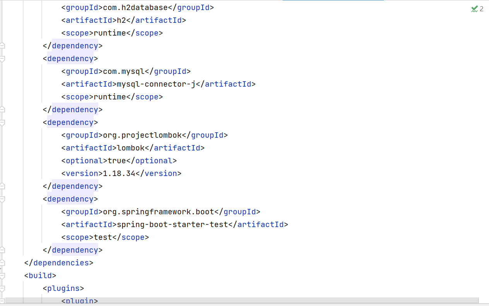

<h2>Activité Pratique N°3 - Spring MVC avec Thymeleaf---Partie 0--- </h2>
<h3>Architecture du projet</h3>

<h3>Class Product</h3>

<h3> Interface ProductRepository</h3>

<h3> Interface ProductController</h3>

<h3> MvcSpring2Application</h3>

<h3> products.html</h3>

<h3> application.properties</h3>

<h3> pom.xml</h3>

<h3> Base de donnée H2 </h3>

<h3>Rendu HTML  </h3>

<h3>Rendu HTML en ajoutant bootstrap </h3>

<h3>Affichage d'un message pour confirmer la suppresion</h3>

<h3>Rendu HTML aprés suppression du produit dont l'ID est 1  </h3>

